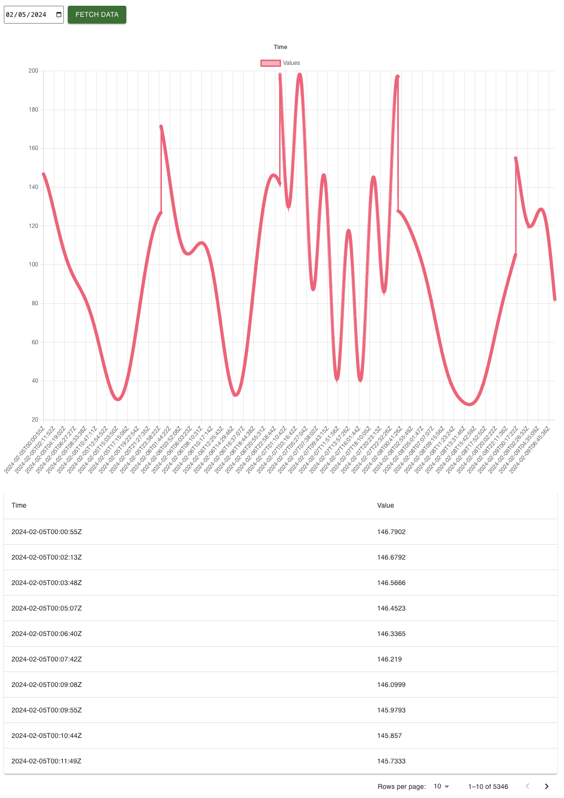

# MODE time project

This project is a simple React application created with Create React App.

## Getting Started

Follow these instructions to get a copy of the project up and running on your local machine for development and testing purposes.

### Prerequisites

Before you begin, make sure you have Node.js and npm installed on your machine.

### Installation

1. Clone the repository to your local machine:

`git clone <repository-url>`

2. Navigate to the project directory:

`cd <project-directory>`

3. Install dependencies:

`npm install`

### Running the Application

To start the development server and view the app in your browser, run:

`npm start`

Runs on 

The app will be available at [http://localhost:3000](http://localhost:3000).

### Running Tests

To run the tests, use the following command:

`npm test`
